# AtomicAST 仕様の欠落ピース洗い出し (2026-06-29)

> ultracode workflow による 12 lens 並列発見 + 3-vote adversarial verify。生存 66 件を意味重複で dedup → 統合 **40 件** に整理。
>
> **本ファイルの位置づけ**: 既存 DR-001〜DR-040 で扱われていない / そもそも DR が存在しない領域の洗い出し。partial DR (Superseded で「別 DR で確定」と明示) の未解消事項も含む。各 finding には新規 DR 候補番号 (DR-041〜) を提案するが、確定は本 finding の review 後とする。
>
> **判断軸**: severity = critical (垂直スライス実装に着手するために確定必須) / important (実装初期に手戻りリスク) / minor (実装後でも追加可能、もしくはスコープ外宣言で足りる)。

## 判明した事実 (= 着手前に確定すべき critical 領域)

垂直スライス実装 (DR-039) を始める前に **どこかで方針を確定しないと実装が手戻る** 領域 (critical) は以下:

1. **F-001 `--` (dashdash) の AtomicAST 表現と意味論**: パース時に `--` 以降のオプション prefix 認識を抑制する機構が bounded path-search (DR-038) の文脈で未定義 → 新規 DR-041 候補
2. **F-007 `global: true` フィールドの伝搬ルールと AtomicAST 展開**: §14.1/§14.2 で例示されているが意味論未定義。help/version/inheritable と直接干渉 → 新規 DR-042 候補
3. **F-016 サブコマンド境界を跨ぐパース意味論 (前後混在 / global 伝搬)**: `git -c key=val commit` 型の前後混在が bounded path-search でどう解けるかが未確認 → F-007 と同時確定
4. **F-019 multiple の min/max アリティ制約**: DR-019 で定義され DR-034 で「別軸分離」と宣言されたまま受け皿がない。`rm path...` / `cp src... dst` が表現不能 → 新規 DR-043 候補
5. **F-024 map 型の key 抽出と value 型注釈**: DR-008 が DR-034/036 で再編された際に key/value 分割機構が削除されたまま。`-D KEY=VAL` パターンが表現不能 → 新規 DR-044 候補
6. **F-027 config ファイル値源の注入機構**: DR-031 が config を優先順位第3層と宣言しているが、env_provider に対応する config_provider が未予約 → 新規 DR-045 候補
7. **F-031 help/version の early-exit 意味論と bounded path-search の整合**: DR-038 の「全消費必須」と help の「途中で打ち切って成功」が衝突 → F-007 と関連
8. **F-035 糖衣展開規則のカノニカル定義 (parse_definition の正規形)**: 同じ UsefulAST から異なる AtomicAST を出す 2 実装が両方仕様準拠に見える状態 → 新規 DR-046 候補

---

## 領域別 findings

### 1. 入力境界 (input-boundary)

| ID | title | severity | 関連 DR | 新規 DR 候補 |
|---|---|---|---|---|
| F-001 | `--` (dashdash) の AtomicAST 表現と意味論 | critical | DR-014, DR-038 | DR-041 |
| F-002 | `allow_equal_separator` の境界ケース + `--flag=value` の bool 特有問題 | important | DR-014, DR-011, DR-039 | DR-041 拡張 |
| F-003 | `short_combine` のバリュー付着形式と分割単位 (byte/codepoint/grapheme) | important | DR-014, DR-038 | DR-041 拡張 |
| F-004 | 空 argv (`parse([])`) の成功条件と required 制約の path-search 統合 | important | DR-038, DR-015 | DESIGN.md §15 追記 |
| F-005 | レスポンスファイル (`@file`) の責務境界の明示 | minor | (なし) | DESIGN.md §0.1 1 行追記 |

#### F-001: `--` (dashdash) の AtomicAST 表現と意味論
- **何が未考慮か**: DR-014 は「dashdash は greedy な exact で children に分岐するシュガー」と述べるのみで、(1) AtomicAST 上の具体表現 (`{exact: "--", children: [...]}` か特殊フラグか)、(2) `--` 消費後のオプション prefix 認識を抑制する機構 (bounded path-search の文脈)、(3) 結果オブジェクトへの出現可否、(4) 入力に `--` が無い場合の fallback、が全て未定義。
- **根拠 (既存 DR)**: DR-014 は config から外す判断記録のみ、DR-038 は「greedy」を廃止したため DR-014 の表現が矛盾する。
- **想定ユースケース**: `git add -- file.txt` / `npm run build -- --watch` / `kubectl exec pod -- ls -la`。
- **提案**: `--` を専用ノード型 (例: `{end_of_options: true}`) として導入するか、`{exact:"--"}` + 後続 children が positionals_only mode で評価される構造保証を AtomicAST に組み込む。DR-038 の bounded path-search との整合を新規 DR で明示。

#### F-002: `allow_equal_separator` の境界ケースと `--flag=value` の bool 特有問題
- **何が未考慮か**: (1) `--name=` (空値) を空文字列として受理するか parse error か、(2) 値中の `=` 分割規則 (最初の `=` のみで分割か)、(3) `--name==val` の扱い、(4) short option への適用可否 (`-x=val`)、(5) bool flag (`exact + literal value:true` 展開) に `--flag=true`/`--flag=false` を渡す経路が AtomicAST に存在しない、(6) DR-039 の `install_eq_split` 合成ノードの正規形。
- **根拠**: DR-014 はフィールド存在のみ、DR-039 は命名対応のみ、DR-015 で flag が exact + literal に展開される展開規則が `=` 後消費パスを持たない。
- **提案**: DR-041 拡張。allow_equal_separator の字句解析規則を明示し、bool flag への optional value argument の AtomicAST 展開形を確定。

#### F-003: `short_combine` のバリュー付着形式と分割単位
- **何が未考慮か**: (1) `short_combine: true` の scope (flags-only `-abc` か値付着 `-ofoo` も含むか)、(2) 値付着を含む場合の解釈ルール (どのノードに残余を試すか、value trial と flag trial の優先順序)、(3) 分割単位 (byte/codepoint/grapheme) が未定義、(4) non-ASCII short option の許容可否。
- **根拠**: DR-014 は「`-abc` 結合許可」のみ、DESIGN.md §7.1 の「各文字が個別」の「文字」単位が未定義、DR-038 の `-n1.0f` 例は ambiguous 判定のみで分割ルール未定。
- **提案**: short フィールドを ASCII 単一文字に制限する方針を canonical とし、Unicode 拡張は contrib 方言として扱う旨を DR-041 拡張で明記。値付着の有効/無効を別フラグで分離。

#### F-004: 空 argv の成功条件と required 制約の path-search 統合
- **何が未考慮か**: required:true 制約が bounded path-search 内で「完全経路の定義に組み込まれる (= required 未充足なら complete path にならない)」か「path-search 完了後の独立バリデーション層か」が未定義。空 argv ではこの曖昧さが最も顕在化。
- **提案**: DESIGN.md §15 に「制約評価のレイヤリング」節を追加。required / exclusive_group / requires が bounded path-search のどのフェーズで評価されるかを明示。

#### F-005: レスポンスファイル (`@file`) の責務境界
- **提案**: DESIGN.md §0.1 に「kuu は前処理済み `Array[String]` を受け取る前提、`@file` 展開や stdin 読み込みは呼び出し側の責務」と 1 行明記。

---

### 2. CLI 起動口の意味論 (cli-entry-semantics)

| ID | title | severity | 関連 DR | 新規 DR 候補 |
|---|---|---|---|---|
| F-006 | exact マッチの Unicode 正規化 (NFC/NFD) と比較単位 | important | DR-026, DR-038, DR-039 | DR-047 |
| F-007 | `global: true` フィールドの伝搬ルールと AtomicAST 展開 (= help/version/サブコマンド前後混在の核心) | **critical** | DR-013, DR-033, DR-017, DR-018 | DR-042 |
| F-008 | コマンドエイリアス (別名) の正規仕様 | important | DR-017, DR-018, DR-011, DR-026 | DR-048 |
| F-009 | `inheritable` の prefix 生成ルール (案A/案B'/案A+B' 未確定) | important | DR-013 | DR-049 (DR-013 後継) |
| F-010 | サブコマンドツリーの動的拡張 (plugin subcommand) の射程 | minor | DR-017, DR-018, DR-020 | DESIGN.md §13.9 追記 |

#### F-007: `global: true` フィールドの伝搬ルールと AtomicAST 展開
- **何が未考慮か**: §14.1/§14.2 の help/version 例と DR-004 旧例で `global: true` が使われているが、定義 DR が存在しない。具体的に未定義: (1) どのネストレベルで受理されるか、(2) 受理時の値がどのスコープの結果に入るか、(3) AtomicAST 展開時に各 command 枝へコピーされるか参照共有か、(4) `inheritable: true` (DR-013) との概念的差異 (`inheritable` は子→祖先方向の書き込み、`global` は親→全子孫方向の受理、と方向が逆だが明文化なし)、(5) help/version の global 伝搬は F-031 の early-exit と直接干渉。
- **根拠**: DR/DESIGN.md 全体に意味論定義なし、§13.9 の「未予約」リストにも載っていない (= 仕様自身が欠落を認識していない)。
- **想定ユースケース**: `git --help` / `git commit --help` / `git -c key=val commit` / `kubectl --context prod get pods` / `docker --log-level debug run image`。
- **提案**: DR-042 で `global: true` の AtomicAST 展開規則を確定。選択肢 (A) parse_definition() 時に全サブコマンドの options[] に複製、(B) パーサが特別扱い、(C) `global` を廃止し `inheritable` の対称機構として再定義。`inheritable` との責務分担も同 DR で整理。

#### F-006: exact マッチの Unicode 正規化と比較単位
- **何が未考慮か**: (1) exact 照合の比較単位 (byte/codepoint/grapheme cluster)、(2) Unicode 正規化方針 (NFC/NFD/NFKC/なし)、(3) values[] 内 exact 糖衣 (§5.3) も同じ穴。
- **根拠**: DR-039 が「言語非依存 JSON 仕様」を最終目標とする以上、exact 照合結果が言語ランタイムごとに分岐するリスクがある。
- **提案**: canonical default は「Unicode codepoint 比較、正規化なし」と明示し、NFC 正規化は contrib 方言として扱う。

#### F-008: コマンドエイリアス (別名) の正規仕様
- **何が未考慮か**: `git co` = `git checkout` のようなエイリアスを表現する正規手段が AtomicAST に存在しない。DR-011 variant DSL はオプション専用、DR-026 exact は1つの match 文字列のみ。DR-007 の ref は別の結果スコープを作るためエイリアスにならない。
- **提案**: 選択肢 (A) command ノードに `aliases: [...]` フィールドを追加し parse_definition() で複数 exact の or 枝に展開、(B) exact ノードが文字列配列を受け取れるよう拡張。結果スコープ統合の意味論を合わせて確定。

#### F-009: `inheritable` の prefix 生成ルール
- **何が未考慮か**: DR-013 Superseded で「案A=直近親のみ / 案B'=相対パス全部 / 案A+B'=衝突時のみ長いパス」の3案が未決定。AtomicAST 展開時に `--socket-ttl` と `--upstream-socket-ttl` のどちらを生成するか実装が決められない。
- **提案**: DR-013 後継 DR として確定 (DR-013 Superseded が「実装着手時に別 DR で確定する」と明言済み)。

#### F-010: サブコマンドツリーの動的拡張 (plugin subcommand)
- **何が未考慮か**: `git foo` (git-foo バイナリへの委譲) / `cargo xtask` のような plugin pattern を AtomicAST で表現する手段がない。wildcard exact / catch-all / remainder passthrough のプリミティブが未定義。
- **提案**: 「AtomicAST は静的閉包な or のみサポート、動的拡張はスコープ外」と DESIGN.md §13.9 で明示するか、wildcard exact プリミティブを新規 DR で追加。

---

### 3. ヘルプ・補完 (help-completion)

| ID | title | severity | 関連 DR | 新規 DR 候補 |
|---|---|---|---|---|
| F-011 | hidden/deprecated の挙動仕様 (発火タイミング、出力先、補完露出) | important | DR-024, DR-021 | DR-050 |
| F-012 | help フィールド (説明文字列) の型・多言語対応の射程 | important | DR-024, DR-022 | DESIGN.md §2.2 追記 |
| F-013 | 補完生成 (completer) の AtomicAST フィールド正規形 | important | DR-036, DR-010 | DR-051 |
| F-014 | サブコマンドの help 出力における階層構造とスコープ別表示 | important | DR-016, DR-017, DR-033 | DR-050 と同時 |
| F-015 | 補完スクリプト静的生成 (zsh/bash/fish) の責務境界 | minor | DR-039, DR-001 | DESIGN.md §0.1 追記 |
| F-016 | suggest (Did you mean?) 機能の AtomicAST フック | minor | DR-037, DR-038, DR-040 | DR-051 と同時 |

#### F-011: hidden/deprecated の挙動仕様
- **何が未考慮か**: §14.3 が「フィールド名のみ予約、挙動は別 DR で確定」と明示。具体的には: (1) hidden=true 時のヘルプ出力 (完全除外 / `[hidden]` 注記 / `--help-all` 表示)、(2) hidden=true 時の補完露出可否、(3) deprecated=true 受理時の警告フォーマット・出力先 (stderr 直書き vs ParserContext.warnings)、(4) deprecated の補完露出可否。
- **根拠**: §14.3 と DR-013 Superseded が「別 DR で確定」と宣言したまま後続 DR なし。
- **提案**: DR-050 で確定。filter warn (DR-021) と deprecated warn は意味論的に別層 (前者はパース中の解釈警告、後者はパース成功後の利用推奨警告) であることも明示。

#### F-014: サブコマンドの help 出力の階層構造
- **何が未考慮か**: §14.1 は「ParserContext の help フラグを立て、完了時に出力切替」と書くが「何を出力するか」が未定義。(1) `mytool --help` vs `mytool commit --help` の差別化、(2) どのスコープの help を表示するかを ParserContext のどのフィールドから判断するか、(3) usage one-liner 自動生成ルール、(4) サブコマンド一覧の自動表示可否、(5) global option の help 表示範囲 (F-007 と直結)。
- **提案**: DR-050 内で F-011 と同時確定。

#### F-013: 補完生成 (completer) の AtomicAST フィールド正規形
- **何が未考慮か**: §13.9 が「フィールド名・registry 区分名は未予約」と明示。DR-036 で `completers` 区分は仮列挙されるが、ノード側の参照フィールド名・組み込み completer (`files`/`dirs` 等) の registry 区分名・関数シグネチャが未定義。
- **提案**: DR-051 で動的補完 (= 実行時候補生成) の AtomicAST 表現形を確定。

#### F-016: suggest (Did you mean?) 機能
- **何が未考慮か**: パース失敗後に近接候補を提示する機構の AtomicAST フックが未予約。(1) パーサが「rejected exact 候補リスト」を Error 情報として保持するか、(2) ParserContext (DR-016) に候補情報フィールドの予約、(3) DR-040 の values 一覧からの候補抽出機構。
- **提案**: 「パーサは試行 exact のリストを Error に含める、近接マッチは DX レイヤの責務」と DR-051 同時に明示するだけで AtomicAST 仕様の負荷は最小。

#### F-012: help フィールドの型と多言語対応
- **提案**: DESIGN.md §2.2 に「help は UsefulAST 専用の表示メタで AtomicAST から除外、型は string、多言語対応は UsefulAST 層の関心 (AtomicAST レベルでは未サポート)」と明記。

#### F-015: 補完スクリプト静的生成の責務境界
- **提案**: 「kuu core は補完スクリプト生成を提供しない、AtomicAST を消費する外部ツールの責務」と DESIGN.md §0.1 で明示。

---

### 4. 国際化・ロケール (i18n-locale)

| ID | title | severity | 関連 DR | 新規 DR 候補 |
|---|---|---|---|---|
| F-017 | 数値型のロケール依存小数点 (canonical default の字句仕様) | important | DR-040 | DR-040 拡張 |
| F-018 | path/file/dir 型のファイルシステムエンコーディング | minor | DR-040, DR-039 | DR-040 拡張 |
| F-019 | value_name の uppercase デフォルト導出の非 ASCII 対応 | minor | DR-024 | DESIGN.md §2.2 1 行追記 |

#### F-017: 数値型の canonical default 字句仕様
- **何が未考慮か**: DR-040 は「canonical default は言語中立の1つを基準」と宣言するが、number/float が `.` を小数点として固定するか否かが明示されていない。欧州ロケール `1,5` を canonical が拒否するか実装依存かが未定義。
- **提案**: DR-040 拡張で「canonical default の number/float は POSIX/en-US ロケールに固定 (`.` 小数点)」と明記。欧州対応は contrib (`contrib_decimal_comma_float`) として提供。

#### F-018: path/file/dir 型のエンコーディング想定
- **提案**: DR-040 拡張で「canonical path/file/dir は OS の文字列 API がそのまま通したバイト列を受け付ける、エンコーディング検証は行わない、存在検証は filters registry の optional 拡張」と明記。

---

### 5. 型システム (type-system)

| ID | title | severity | 関連 DR | 新規 DR 候補 |
|---|---|---|---|---|
| F-020 | multiple の min/max アリティ制約 (positional の `path...`) | **critical** | DR-019, DR-034 | DR-043 |
| F-021 | map 型の key 抽出と value 型注釈 (`-D KEY=VAL` パターン) | **critical** | DR-034, DR-036, DR-008, DR-040 | DR-044 |
| F-022 | optional の semantics (unset / null / default の 3 区別) | important | DR-016, DR-031, DR-015 | DR-052 |
| F-023 | enum 型 (definitions.types 内の `values`) の AtomicAST 展開正規形 | important | DR-028, DR-035, DR-005 | DR-046 (F-035 と同時) |
| F-024 | count 型の上限・飽和・値範囲制約 | minor | DR-028, DR-036, DR-015 | DR-028 拡張 |
| F-025 | bytes/binary 型の組み込み/拡張線引き基準 | minor | DR-040, DR-028 | DESIGN.md §3.3 1 行追記 |

#### F-020: multiple の min/max アリティ制約
- **何が未考慮か**: DR-019 で `multiple: {min:1}` 等が定義されていたが、DR-034 の再設計で「個数制約は別軸として分離」と宣言されたまま受け皿 DR が未作成。`rm path...` (min:1) / `cp src... dst` (min:1, max:-1) を AtomicAST で表現する手段が消失。
- **根拠**: DESIGN.md §6 multiple 節、§9 制約節、§13.9 未予約リストのいずれにも記述なし。仕様自身が欠落を可視化していない。
- **提案**: DR-043 で個数制約フィールドの置き場所 (ノードトップレベル属性 / multiple サブフィールド / 別オブジェクト) を確定。bounded path-search (DR-038) が min=1 の「少なくとも1個」をどう扱うかも合わせて規定。

#### F-021: map 型の key 抽出と value 型注釈
- **何が未考慮か**: (1) `map` プリセットが前提とする `{k,v}` を piece から取り出す機構が未定義 (DR-008 の `key_value_separator: "="` が DR-034/036 の再編成で削除され、代替なし)。(2) `Map<K,V>` の V 型を指定する手段が未定義 (`type: "int"` + `multiple: "map"` で piece 全体が int parse される経路しかない)。(3) `to_map` collector のシグネチャ `T[] → Map<K,V>` の T が `{k:string, v:string}` か `string` かが未定義。
- **想定ユースケース**: `-D HOST=localhost -D PORT=8080` で `Map<string,string>`、`-D TIMEOUT=30` で `Map<string,int>`、`--header Content-Type=application/json`。
- **提案**: DR-044 で `separator` を 1D (item 列挙) と 2D (key/value 分割) に分けるか、`to_map` collector に key 抽出引数を持たせるかを確定。`kv_pair` 組み込み型の予約も検討。

#### F-022: optional の semantics (unset / null / default の 3 区別)
- **何が未考慮か**: 結果オブジェクト (シンプルモード) で「未指定フィールドの表現」が未定義。(1) absent (キーなし) か present-null か、(2) JSON null か言語の null/undefined か、(3) default あり/なしで言語 DX が生成する型が変わるか (T vs T? vs T | null)。ParserContext 側の committed/source は定義されているが結果オブジェクト側の仕様が空白。
- **提案**: DR-052 で「unset=absent-key / explicit-null は committed=true + value=null / default 適用済みは committed=false + value=default」の3区別を言語非依存に定義。

#### F-023: definitions.types に登録した enum 型の展開正規形
- **何が未考慮か**: `{values: [...]}` を definitions.types に置いた場合、AtomicAST 上で or 展開されるか type 参照のまま残り value_parser で制限されるかが未定義。未定義値エラーが「or の 0 経路失敗 (構造エラー)」か「filter Error」かも未定義。
- **提案**: DR-046 (F-035 糖衣展開規則と同時) で確定。

#### F-024: count 型の上限・飽和
- **何が未考慮か**: (1) count の上限指定方法 (canonical 記法)、(2) 上限超過時の挙動 (Error / 飽和)、(3) `--verbose=3` (allow_equal_separator 経由) が `-vvv` と等価か。
- **提案**: DR-028 拡張で count プリセットの上限制約を確定。

---

### 6. 制約システム (option-constraints)

| ID | title | severity | 関連 DR | 新規 DR 候補 |
|---|---|---|---|---|
| F-026 | `requires` の評価タイミング・committed/selected 判定・Reject vs Error 帰属 | important | DR-012, DR-016, DR-038, DR-037 | DR-053 |
| F-027 | `exclusive_group` の評価タイミングと bounded path-search 統合 | important | DR-012, DR-038 | DR-053 と同時 |
| F-028 | 条件付き制約 (値依存の requires) を許容するか or 構造に誘導するか | minor | DR-012, DR-037 | DESIGN.md §9 追記 |

#### F-026 + F-027: 制約評価レイヤリングの確定
- **何が未考慮か**: DR-012 が `required` / `requires` / `exclusive_group` を属性として定義したが、これらが bounded path-search (DR-038) のどのフェーズで評価されるかが未定義。具体的には: (1) 「起動された」が committed か selected か、(2) パース中の逐次評価か全消費後の事後検証か、(3) 違反が path Reject (他経路を試す) か Error (全体失敗の表示候補) か、(4) `requires` の有向性 (A→B が B→A を意味しないことの明示)、(5) `exclusive_group` 違反 (`--json --yaml` 共指定) は 1 経路成立後の事後制約か ambiguous か、(6) 違反時エラー報告フォーマット (どのグループ/要素が衝突したか)。F-004 (空 argv) も同じレイヤリング問題に帰着。
- **提案**: DR-053 で「制約評価は完全経路決定後の事後検証フェーズ」として位置付け、bounded path-search と直交する別レイヤとして整理。Error 種別 (Error で全体失敗) と報告フォーマットも同時確定。

#### F-028: 条件付き制約 (値依存の requires)
- **提案**: 「value-conditional な制約は or 構造で構造的に表現するパターンに誘導、専用フィールドは追加しない」と DESIGN.md §9 で明示。

---

### 7. 環境変数・設定ファイル・値源 (env-config-precedence)

| ID | title | severity | 関連 DR | 新規 DR 候補 |
|---|---|---|---|---|
| F-029 | config ファイル値源の注入機構 (config_provider, AST フィールド) | **critical** | DR-031, DR-014, DR-030, DR-036 | DR-045 |
| F-030 | auto_env 時の名前変換規則 (kebab/camel → UPPER_SNAKE, env_prefix 連結, 階層スコープ) | important | DR-014, DR-022, DR-024 | DR-054 |
| F-031 | env_provider レジストリのインターフェース契約 (シグネチャ, 適用タイミング, 値なし表現, 合成可否) | important | DR-010, DR-036, DR-031 | DR-054 と同時 |
| F-032 | ParserContext.source の取りうる値の完全列挙と境界条件 (link vs cli, mutation 後, variant default) | minor | DR-016, DR-031, DR-029 | DR-031 拡張 |
| F-033 | 機微情報 (sensitive/secret) のマスキングの AtomicAST 責務範囲 | important | DR-030, DR-016, DR-031 | DR-055 |
| F-034 | 複数環境・プロファイル切替 (dev/prod/test) のスコープ境界宣言 | minor | DR-030, DR-031, DR-014 | DESIGN.md §12 追記 |

#### F-029: config ファイル値源の注入機構
- **何が未考慮か**: DR-031 が config を優先順位第3層と宣言したまま、(1) config_provider registry 区分が DR-036 の 8 区分にない、(2) ノードに config binding を指定するフィールド名 (例: `config_key`) が未予約、(3) DR-030 の `{config:...}` 記法は DR-014 の AST 内継承設定 `config` と名前衝突、(4) ファイルフォーマット (TOML/YAML/JSON)・探索ルール・複数ファイルマージ戦略が未定義、(5) §13.9 未予約リストにも明記なし (= 仕様自身の認識外)。
- **提案**: DR-045 で env_provider と対称な config_provider を定義、または「config ファイル読み込みは利用者責務、AtomicAST の値源 config は link や実体ノードで表現する」と明示してスコープを縮退。

#### F-030: auto_env 時の名前変換規則
- **何が未考慮か**: `config.auto_env: true` + `config.env_prefix: "MYAPP"` 時の key name → env var 名生成ルールが未定義。(1) kebab/camel から UPPER_SNAKE への変換アルゴリズム、(2) env_prefix 連結セパレータ、(3) 階層スコープでの結合 (`serve.port` → `MYAPP_SERVE_PORT` か `MYAPP_PORT` か)、(4) 明示 `env:` フィールドと auto_env の優先関係。
- **提案**: DR-054 で確定。

#### F-031: env_provider レジストリのインターフェース契約
- **何が未考慮か**: (1) 関数シグネチャ (`(key: string) → string | null` 等)、(2) env_prefix 適用タイミング (provider 呼び出し前か後か = provider が受け取るのは `"PORT"` か `"MYAPP_PORT"` か)、(3) 値なし表現 (null / undefined / 空文字 / throw) と DR-031 優先順位との fallback 契約、(4) 複数 env_provider の合成 (overrides チェーン)、(5) デフォルト実装の階層帰属 (DR-010 の 3 階層)。他 registry はインターフェース型を持つが env_provider だけ「名前だけある」状態。
- **提案**: DR-054 で F-030 と同時確定。

#### F-033: 機微情報のマスキング
- **何が未考慮か**: (1) AST に `sensitive: true` フラグの予約有無、(2) ParserContext debug/diagnose 出力時のマスキング機構、(3) `hidden: true` との概念分離の明示、(4) §13.9 にも記載なし (意図的除外か単純見落としか判別不能)。
- **提案**: DR-055 で「AST は sensitive 概念を持たない、機微情報マスキングは実装層 (logger / diagnose 実装) の責務」と明示するか、`sensitive: true` フラグを正規予約。

#### F-032: source フィールドの境界条件
- **何が未考慮か**: DR-031 で `source ∈ {cli, link, env, config, inherit, default}` は列挙済みだが、(1) `source: "config"` が立つ条件 (F-029 と連動)、(2) link 経由で env 由来値が来た場合の source、(3) あと勝ち mutation 後の source (最後の源か履歴か)、(4) variant `"no:default"` 適用後の source。
- **提案**: DR-031 拡張で source 確定ルールを補強。F-029 確定後に対応。

---

### 8. ライフサイクル・フック (lifecycle-hook)

| ID | title | severity | 関連 DR | 新規 DR 候補 |
|---|---|---|---|---|
| F-035 | parse_definition() の失敗挙動 (UsefulAST バリデーション) | important | DR-001, DR-021, DR-013 | DR-056 |
| F-036 | post-parse 意味検証フック (cross-field validator) の AtomicAST 表現 | important | DR-009, DR-010, DR-016, DR-038 | DR-057 |
| F-037 | help/version の early-exit と bounded path-search の整合 | **critical** | DR-038, DR-016, DR-021 | DR-042 (F-007 と同時) |

#### F-037: help/version の early-exit と bounded path-search の整合
- **何が未考慮か**: §14.1 の help は「ParserContext の help フラグを立て、完了時に出力切替」だが、DR-038 の「全消費必須」と衝突する: (1) `mytool --help --invalid-flag` で `--invalid-flag` が未知の場合に完全経路 0 本 → DR-038 上はパース失敗だが help intent は成功扱いにすべきか、(2) help フラグが立った時点で残り引数の消費エラーを無視するか、(3) `--version` も同じ問題を持つが ParserContext の特別フラグもない、(4) F-007 (global) と組み合わせると `mytool commit --help` の挙動も未定義。
- **提案**: DR-042 (F-007) と同時に確定。help/version の AtomicAST に `early_exit: true` 属性を予約し、bounded path-search の例外条件として定式化するか、「help フラグ立ち後は残トークン全消費を緩和」するモードを ParserContext で定義。

#### F-035: parse_definition() の失敗挙動
- **何が未考慮か**: UsefulAST が不正な場合 (unknown フィールド / 矛盾属性 / 循環 ref / 不在 link / exclusive_group + requires 矛盾) に parse_definition() がどう振る舞うかが完全未定義。DR-021 の「warn のみ・reject しない」は実行時パースの方針で、定義コンパイルフェーズに適用されるかが不明。
- **提案**: DR-056 で「構造的不整合 = Error / 意味的潜在問題 = warn」の判断基準を確定。warn 出力先 (ParserContext.warnings リストへの積上げ) も同時定義。

#### F-036: post-parse 意味検証フック
- **何が未考慮か**: DR-009 で filter を「他要素整合チェック禁止、post-parse はアプリ側」と切り捨てたが、アプリが post-parse バリデータを注入する AtomicAST 上のフック (validators registry 区分 / フィールド名 / シグネチャ) が一切未予約。§13.9 にも記載なし。
- **想定ユースケース**: 「`--start` が `--end` より前」「path 実在確認」「相互依存オプションの整合性」。
- **提案**: DR-057 で「post-parse validator は AtomicAST の責務外、アプリが ParserContext を受け取って独自検証する」と明示するか、validators registry を正規予約。

---

### 9. ストリーミング・部分パース (streaming-partial)

| ID | title | severity | 関連 DR | 新規 DR 候補 |
|---|---|---|---|---|
| F-038 | shell completion 用 partial parse モード (入力 + カーソル位置 → 候補) | important | DR-036, DR-038, DR-039 | DR-058 |
| F-039 | パース失敗時の部分結果 (ParserContext 途中状態) の API 契約 | minor | DR-016, DR-038, DR-037 | DR-016 拡張 |
| F-040 | TTY 検出・カラー出力・interactive プロンプトの責務境界 | minor | DR-031, DR-035 | DESIGN.md §13 追記 |

#### F-038: shell completion 用 partial parse モード
- **何が未考慮か**: 通常パース (DR-038) は「全消費完全経路ちょうど 1 本」だが、shell completion は「部分入力を消費できる経路を列挙し、次トークン位置の期待ノード種別を返す」操作で全消費を条件にできない。AtomicAST 評価器に partial parse API (入力列 + カーソル位置 → 候補ノードリスト) のシグネチャが未定義、completer (F-013) を呼び出すパース文脈契約も未定義。
- **提案**: DR-058 で bounded path-search を「全消費必須 (通常パース)」と「部分入力許容 (補完クエリ)」の 2 モードに分離して定義。

#### F-039: パース失敗時の部分結果
- **提案**: DR-016 拡張で「failure 時に partial ParserContext を返す API 契約 (Result<Ok, Err+partial>)」を確定するか「失敗時は Error のみ、部分状態は公開しない」と明示。

#### F-040: TTY 検出・カラー・interactive
- **提案**: DESIGN.md §13 に「AtomicAST は TTY / カラー / interactive を知らない、出力レンダリングは実装側責務」と明示。

---

### 10. テスタビリティ・適合性 (testability-conformance)

| ID | title | severity | 関連 DR | 新規 DR 候補 |
|---|---|---|---|---|
| F-041 | 糖衣展開規則のカノニカル定義 (parse_definition の正規形列挙) | **critical** | DR-001, DR-026, DR-011, DR-017, DR-018 | DR-046 |
| F-042 | AtomicAST の合法構造 (invariant) 定義 (property-based test 用) | important | DR-038, DR-039, DR-026 | DR-046 と同時 |
| F-043 | ambiguous エラー / パース失敗時の戻り値 JSON 構造 | important | DR-037, DR-038 | DR-059 |
| F-044 | filter registry の組み込み標準セット (canonical 一覧と各シグネチャ) | minor | DR-009, DR-035, DR-036, DR-040 | DR-040 拡張 |

#### F-041: 糖衣展開規則のカノニカル定義
- **何が未考慮か**: UsefulAST → AtomicAST 変換 (parse_definition) の展開規則が DESIGN.md 全体に散在し、網羅的かつ一意な定義がない。具体的に: (1) variant DSL (`"no:set:false"`) → 主名側入口の AtomicAST が示されない、(2) `type:"flag"` / `type:"count"` / `type:"command"` プリセットの展開後 AtomicAST 形が示されない、(3) `values` 入れ子の再帰展開ルール、(4) DR-011 の `{type:"exact"}` 記法と §1.2 の `{exact:"..."}` 記法の同一性が未定義。同じ UsefulAST から異なる AtomicAST を出す 2 実装が両方仕様準拠に見える状態。
- **提案**: DR-046 で各糖衣について「入力 UsefulAST → 出力 AtomicAST」のペアを仕様の一部とする。F-023 (definitions.types enum)、F-042 (合法構造 invariant) と同時確定。

#### F-042: AtomicAST の合法構造 (invariant) 定義
- **何が未考慮か**: bounded path-search を property-based test で検証するには合法 AtomicAST 生成器が必要だが、(1) seq/or の children 最小数 (0個・1個は合法か)、(2) multiple を持つノードを or/seq children に入れる制約、(3) name の文字種・長さ制限、(4) 同一 seq 内の同名 long option 重複の合法性、が未定義。DR-039 が「JSON Schema は実装と同時」と意図的 defer しているが、property-based test の合法性判定根拠が不在。
- **提案**: DR-046 で AtomicAST の well-formedness 規則を機械可読な invariant チェックリストとして定義。

#### F-043: エラー報告の戻り値 JSON 構造
- **何が未考慮か**: (1) parse() 失敗時の返値型 (例外 / Result<Ok,Err> / `{error}` / `{error, partial_context}`)、(2) ambiguous エラーオブジェクトの JSON 構造 (type タグ / 競合経路リストの形)、(3) 競合経路を 2 本ダンプするか 1 本のみか (DR-037 が未確定と明記)、(4) ParserContext の失敗時状態 (F-039 と関連)。
- **提案**: DR-059 で「成功 | parse-failure (error) | ambiguous」の 3 値 discriminated union と各々のフィールドを定義。DESIGN.md §15 に「エラー報告の構造」節を追加。

#### F-044: filter registry の組み込み標準セット
- **何が未考慮か**: `trim` / `non_empty` / `in_range` 等が DESIGN.md に例示されるが、(1) コア/標準/拡張の分類、(2) 各 filter のシグネチャ (in_range の inclusive/exclusive、trim の対象文字セット ASCII vs Unicode、non_empty が空を Reject か Error か)、(3) DR-040 と同等の 3 層構造が filters registry にない。
- **提案**: DR-040 拡張で filter registry にも canonical/標準/拡張の 3 層を適用、組み込み filter のシグネチャ一覧を明記。

---

### 11. メタ仕様 (meta-spec)

| ID | title | severity | 関連 DR | 新規 DR 候補 |
|---|---|---|---|---|
| F-045 | DR 番号空間の分離ルールと `[external: ...]` 記法の文書化 | minor | DR-001, DR-034, DR-039, DR-040 | runbook 追記 |
| F-046 | 新規 DR を立てる判断基準 (新規 vs 既存 DR 更新) | important | DR-038, DR-035, DR-039 | runbook 追記 |
| F-047 | partial DR (Superseded 内未確定事項) の解消方針とトラッキング | minor | DR-013 | runbook 追記 |
| F-048 | JSON Schema の lifecycle と breaking change 手続き (= 仕様安定化フェーズゲート) | important | DR-039, DR-022, DR-001 | DR-060 |

#### F-046: 新規 DR を立てる判断基準
- **何が未考慮か**: cleanup runbook は既存 DR 整理 (active/partial/full 分類) のみ扱い、新規 DR 起票の閾値が射程外。垂直スライス実装フェーズで多数の判断発生が確定しているにもかかわらず、(1) 既存判断覆し → 新規 DR、(2) 補完・拡張 → 既存 DR 更新、(3) 完全新領域 → 新規 DR、の分岐が明文化されていない。
- **提案**: dr-corpus-cleanup runbook に「新規 DR を立てる判断基準」節を追加。

#### F-048: JSON Schema lifecycle と breaking change 手続き
- **何が未考慮か**: DR-039 と §15.7 は「JSON Schema は実装と同時に詰める」と defer するが、(1) いつ確定版として発行するか、(2) フィールド追加/削除/改名時の更新手続き、(3) $schema URI 埋め込み有無、(4) 複数言語バインディングのバージョン参照管理、(5) 「確定済み仕様」と「変更可能な仕様」の区別基準 (= フェーズゲート)、(6) breaking change の定義 (フィールド追加 = 後方互換? 削除 = 破壊的? 意味論変更の扱い)、が未定義。
- **提案**: DR-060 で JSON Schema lifecycle を確定。実装着手直後に立てる (DR-039 の defer 条件「垂直スライス後」を満たすため)。「現在は共設計中 = 破壊的変更許容」というフェーズ宣言を DESIGN.md §0 に partial fix として先行追加。

#### F-045: DR 番号空間の分離
- **提案**: runbook に「ast-spec の DR 番号空間は kuu.mbt 本体と独立、`[external: kuu.mbt DR-NNN]` 記法は他系統参照に使用」を追記。

#### F-047: partial DR の未確定事項トラッキング
- **提案**: 「Superseded 内で『別 DR で確定』と書かれた事項は、各 partial DR を発生源として個別に新規 DR 候補化する」「DESIGN.md §0 に『現在未確定の事項リスト』節を追加し、解消優先度を可視化する」を runbook に明記。

---

## 依存グラフ

```mermaid
graph TD
  %% critical 群 (実装着手前に確定必須)
  F-001[F-001 dashdash AtomicAST 表現]
  F-007[F-007 global フィールド伝搬]
  F-020[F-020 multiple min/max]
  F-021[F-021 map key/value]
  F-029[F-029 config_provider]
  F-037[F-037 help/version early-exit]
  F-041[F-041 糖衣展開規則カノニカル]

  %% 直接依存
  F-007 --> F-037
  F-007 --> F-014[F-014 help 階層構造]
  F-007 --> F-016c[F-016 サブコマンド前後混在 = F-007 統合]
  F-029 --> F-032[F-032 source 境界条件]
  F-021 --> F-020
  F-041 --> F-042[F-042 invariant 定義]
  F-041 --> F-023[F-023 definitions.types enum 展開]
  F-002[F-002 allow_equal_separator] --> F-041
  F-003[F-003 short_combine] --> F-041
  F-001 --> F-041

  %% 制約レイヤリングの依存
  F-004[F-004 空 argv + required レイヤ] --> F-026[F-026 requires タイミング]
  F-026 --> F-027[F-027 exclusive_group タイミング]
  F-026 --> F-043[F-043 エラー JSON 構造]
  F-037 --> F-043

  %% env/config 依存
  F-029 --> F-030[F-030 auto_env 変換]
  F-029 --> F-031[F-031 env_provider 契約]
  F-029 --> F-034[F-034 profile 切替]

  %% help / 補完
  F-011[F-011 hidden/deprecated] --> F-014
  F-013[F-013 completer フィールド] --> F-038[F-038 partial parse]
  F-016[F-016 suggest] --> F-013

  %% lifecycle
  F-035[F-035 parse_definition 失敗挙動] --> F-041
  F-036[F-036 post-parse validator] --> F-026

  %% meta
  F-046[F-046 新規 DR 判断基準] -.先行.-> F-001
  F-046 -.先行.-> F-007
  F-046 -.先行.-> F-020
  F-046 -.先行.-> F-021
  F-046 -.先行.-> F-029
  F-048[F-048 JSON Schema lifecycle] --> F-042
  F-048 --> F-043

  %% type system
  F-022[F-022 optional semantics] --> F-043
  F-017[F-017 数値ロケール] -.DR-040 拡張.-> F-044[F-044 filter 組み込み]
  F-018[F-018 path エンコ] -.DR-040 拡張.-> F-044

  classDef critical fill:#f99,stroke:#900,stroke-width:2px
  classDef important fill:#fc9,stroke:#960,stroke-width:1px
  classDef minor fill:#cfc,stroke:#393,stroke-width:1px

  class F-001,F-007,F-020,F-021,F-029,F-037,F-041 critical
  class F-002,F-003,F-004,F-006,F-008,F-009,F-011,F-012,F-013,F-014,F-017,F-022,F-023,F-026,F-027,F-030,F-031,F-033,F-035,F-036,F-038,F-042,F-043,F-046,F-048 important
  class F-005,F-010,F-015,F-016,F-018,F-019,F-024,F-025,F-028,F-032,F-034,F-039,F-040,F-044,F-045,F-047 minor
```

---

## 推奨着手順序

### Phase 0 (meta 整備: DR-041 を起票する前に決める)

1. **F-046 (新規 DR 判断基準)**: runbook 追記で完了。これがないと F-001 以降の DR 起票方針がぶれる。
2. **F-048 partial fix** (現在「共設計中=破壊的変更許容」を §0 で宣言): 1 行で済む、後続 DR 全体の前提を明確化。

### Phase 1 (critical 確定: 垂直スライス実装着手の必須条件)

3. **F-007 + F-037 + F-014** (DR-042: global / help / version の伝搬と early-exit を一括確定): 4 件の独立 finding が同じ概念に帰着するため一気に解決。サブコマンド前後混在も同 DR で吸収。
4. **F-001 + F-002 + F-003** (DR-041: dashdash / equal_separator / short_combine の AtomicAST 表現): 入力境界の 3 大未定義領域。bounded path-search との整合を一貫させるため同 DR。
5. **F-020** (DR-043: multiple min/max): 完全に独立、`rm path...` を扱う前に必要。
6. **F-021** (DR-044: map key/value): F-020 完了後 (multiple 関連を続けて処理)。
7. **F-029** (DR-045: config_provider): 独立、F-030/F-031/F-032/F-034 の前提。
8. **F-041 + F-042 + F-023** (DR-046: 糖衣展開規則のカノニカル定義 + AtomicAST invariant + definitions.types enum 展開): conformance test の根幹。

### Phase 2 (important: 実装中に固める)

9. **F-026 + F-027 + F-004** (DR-053: 制約評価レイヤリングの統合確定)
10. **F-043** (DR-059: エラー報告の JSON 構造): F-026/F-037 確定後。
11. **F-011 + F-014 後段** (DR-050: hidden/deprecated 挙動、help 階層仕様)
12. **F-013 + F-016 + F-038** (DR-051 + DR-058: 補完まわり一括: completer / suggest / partial parse mode)
13. **F-009** (DR-049: inheritable prefix 生成ルール: DR-013 後継)
14. **F-008** (DR-048: コマンドエイリアス)
15. **F-006** (DR-047: exact マッチ Unicode 比較ルール)
16. **F-030 + F-031** (DR-054: auto_env 変換 + env_provider 契約)
17. **F-033** (DR-055: 機微情報マスキング責務境界)
18. **F-035 + F-036** (DR-056 + DR-057: parse_definition 失敗挙動 + post-parse validator)
19. **F-022** (DR-052: optional semantics)
20. **F-048 完全版** (DR-060: JSON Schema lifecycle): 垂直スライス完了直後。

### Phase 3 (minor: スコープ宣言・1 行追記で済む)

21. F-005 (response file 責務): DESIGN.md §0.1
22. F-010 (plugin subcommand 射程): DESIGN.md §13.9
23. F-015 (補完スクリプト生成責務): DESIGN.md §0.1
24. F-019 (value_name uppercase 非 ASCII): DESIGN.md §2.2
25. F-025 (bytes 型基準): DESIGN.md §3.3
26. F-028 (条件付き制約 = or 誘導): DESIGN.md §9
27. F-034 (profile 切替スコープ外宣言): DESIGN.md §12
28. F-040 (TTY/カラー責務): DESIGN.md §13
29. F-045 + F-047 (DR 番号空間 / partial DR トラッキング): runbook
30. F-017 + F-018 + F-024 + F-044 (DR-040 拡張: 数値ロケール / path エンコ / count 上限 / filter canonical 一覧)
31. F-032 (source 境界条件: F-029 後)
32. F-039 (failure 時 partial context: F-043 後)

---

## 補遺: dedup で統合された原 finding (66 → 40)

| 統合先 | 原 finding (lens × area) |
|---|---|
| F-001 | input-boundary × input-boundary "`--` 終端トークン" |
| F-002 | input-boundary × input-boundary "`allow_equal_separator` 境界" + option-constraints × option-constraints "`--flag=value`" |
| F-003 | input-boundary × input-boundary "`short_combine` バリュー付着" + i18n-locale × cli-entry-points "short_combine トークン分割単位" |
| F-004 | input-boundary × input-boundary "空 argv" |
| F-005 | input-boundary × input-boundary "レスポンスファイル" |
| F-006 | i18n-locale × parse-semantics "exact Unicode 正規化" |
| F-007 | help-completion × help-completion "global:true 伝搬" + subcommand × subcommand "global:true 意味論" + lifecycle-hook × lifecycle-hook "global フラグ伝搬" + streaming-partial × global-flag-propagation "global フラグ伝搬" + meta-spec × meta-spec "global: true フィールド" + subcommand × subcommand "サブコマンド前後混在" |
| F-008 | subcommand × subcommand "コマンドエイリアス" |
| F-009 | subcommand × subcommand "inheritable prefix 生成" |
| F-010 | subcommand × subcommand "plugin subcommand 動的拡張" |
| F-011 | help-completion × help-completion "hidden/deprecated 挙動" + lifecycle-hook × lifecycle-hook "deprecated 警告発火タイミング" |
| F-012 | help-completion × help-completion "help フィールド型・多言語" |
| F-013 | help-completion × help-completion "completer AtomicAST フィールド" |
| F-014 | help-completion × help-completion "サブコマンド help 階層構造" |
| F-015 | help-completion × help-completion "補完スクリプト機械的変換" |
| F-016 | error-reporting × error-reporting "suggest (Did you mean?)" + subcommand × subcommand "未知サブコマンド候補提示" |
| F-017 | i18n-locale × type-system "数値型ロケール依存小数点" |
| F-018 | i18n-locale × type-system "path/file/dir エンコーディング" |
| F-019 | i18n-locale × name-and-scope "value_name uppercase 非 ASCII" |
| F-020 | option-constraints × option-constraints "multiple min/max アリティ" |
| F-021 | type-system × type-system "map 型 key 抽出" + type-system × type-system "map 型 value 型注釈" |
| F-022 | type-system × type-system "optional semantics 3 区別" |
| F-023 | type-system × type-system "enum 型 definitions 展開" |
| F-024 | option-constraints × option-constraints "count 上限・飽和" |
| F-025 | type-system × type-system "bytes/binary 型" |
| F-026 | option-constraints × option-constraints "requires 評価タイミング" |
| F-027 | option-constraints × option-constraints "exclusive_group パース時評価" |
| F-028 | option-constraints × option-constraints "条件付き制約 (値依存 requires)" |
| F-029 | env-config-precedence × env-config-precedence "config file source 機構" + lifecycle-hook × lifecycle-hook "config ファイル値源 AtomicAST 規約" |
| F-030 | env-config-precedence × env-config-precedence "auto_env 名前変換規則" |
| F-031 | env-config-precedence × env-config-precedence "env_provider インターフェース契約" |
| F-032 | input-boundary × input-boundary "ParserContext.source cli 内区別" + env-config-precedence × env-config-precedence "source 値の列挙と境界条件" + lifecycle-hook × lifecycle-hook "source 取りうる値" |
| F-033 | env-config-precedence × env-config-precedence "機微情報マスキング" |
| F-034 | env-config-precedence × env-config-precedence "複数環境・プロファイル切替" |
| F-035 | lifecycle-hook × lifecycle-hook "parse_definition() 失敗挙動" |
| F-036 | lifecycle-hook × lifecycle-hook "post-parse validate フック" |
| F-037 | lifecycle-hook × lifecycle-hook "help/version パース中断意味論" + streaming-partial × early-exit-semantics "--help 起動時打ち切り条件" |
| F-038 | streaming-partial × shell-completion-partial-parse "partial parse モード" |
| F-039 | streaming-partial × partial-result-on-failure "失敗時部分結果" |
| F-040 | streaming-partial × tty-detection "TTY 検出振る舞い" |
| F-041 | testability-conformance × sugar-expansion "糖衣展開規則境界" |
| F-042 | testability-conformance × spec-normalization "property-based test 合法構造" |
| F-043 | testability-conformance × error-reporting "ambiguous エラー報告内容" |
| F-044 | testability-conformance × type-system "filter registry 組み込み一覧" |
| F-045 | meta-spec × meta-spec "DR 番号空間分離ルール" |
| F-046 | meta-spec × meta-spec "新規 DR 判断基準" |
| F-047 | meta-spec × meta-spec "partial DR 未確定事項解消方針" |
| F-048 | meta-spec × meta-spec "JSON Schema lifecycle" + meta-spec × meta-spec "breaking change 手続き" |

**統合内訳**: 66 件 → 40 件 (F-001〜F-048 のうち F-016c は F-007 に統合済、欠番なし)。

統合の主軸:
- `global: true` 関連 6 件 → F-007 + F-037 + F-014 に再編 (3 件で吸収)
- `source` フィールド関連 3 件 → F-032 単一化
- config file 関連 2 件 → F-029 単一化
- map 型関連 2 件 → F-021 単一化
- short_combine 関連 2 件 → F-003 単一化
- `--flag=value` / equal_separator 関連 2 件 → F-002 単一化
- did-you-mean / suggest 2 件 → F-016 単一化
- help/version early-exit 2 件 → F-037 単一化
- hidden/deprecated 2 件 → F-011 単一化
- JSON Schema lifecycle / breaking change 2 件 → F-048 単一化
